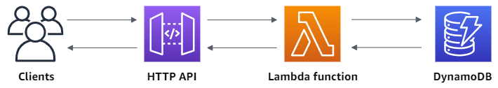

---

# Serverless CRUD API with AWS Lambda, DynamoDB, and API Gateway

This repository provides a step-by-step guide to set up a serverless CRUD API using AWS Lambda, DynamoDB, and API Gateway. The API allows for creating, reading, updating, and deleting items from a DynamoDB table.



## Prerequisites

Before you begin, ensure you have the following:

- An AWS account
- AWS CLI installed and configured
- curl or a similar tool for testing API requests

## Setup Steps

### 1. Create DynamoDB Table

Create a DynamoDB table with a unique ID as the partition key:

```sh
# AWS Console Steps:
# - Choose Create table.
# - Set Table name to your preferred name.
# - Set Partition key to 'id'.
# - Choose Create table.
```

### 2. Create Lambda Function

Create a Lambda function with permissions to interact with DynamoDB:

```sh
# AWS Console Steps:
# - Choose Create function.
# - Set Function name to your preferred name.
# - Configure permissions using Simple microservice permissions policy.
# - Choose Create function.
# - Open index.mjs in the console's code editor, and replace its contents with the provided index.mjs file.
# - Deploy the function.
```

### 3. Create HTTP API

Create an HTTP API using API Gateway:

```sh
# AWS Console Steps:
# - Choose Create API, and then for HTTP API, choose Build.
# - Set API name to your preferred name.
# - Configure routes, skipping route creation for now.
# - Review and create the API.
```

### 4. Create Routes

Create four routes for the API: GET /items/{id}, GET /items, PUT /items, DELETE /items/{id}.

```sh
# AWS Console Steps:
# - Choose your API.
# - Choose Routes.
# - Create routes for GET /items/{id}, GET /items, PUT /items, DELETE /items/{id}.
```

### 5. Create Integration

Create a Lambda integration for connecting routes to backend resources:

```sh
# AWS Console Steps:
# - Choose your API.
# - Choose Integrations.
# - Manage integrations and create a Lambda integration.
```

### 6. Attach Integration to Routes

Attach the Lambda integration to all routes:

```sh
# AWS Console Steps:
# - Choose your API.
# - Choose Integrations.
# - Attach the Lambda integration to all routes.
```

### 7. Test Your API

Retrieve the API's invoke URL from the API Gateway and use curl commands for testing CRUD operations:

```sh
# Example curl commands:
# - Create or update an item:
curl -X "PUT" -H "Content-Type: application/json" -d "{\"id\": \"123\", \"price\": 12345, \"name\": \"myitem\"}" <API-INVOKE-URL>/items

# - Get all items:
curl <API-INVOKE-URL>/items

# - Get an item by ID:
curl <API-INVOKE-URL>/items/123

# - Delete an item:
curl -X "DELETE" <API-INVOKE-URL>/items/123
```

For more detailed information and guidance, refer to the [official AWS documentation](https://docs.aws.amazon.com/apigateway/latest/developerguide/http-api-dynamo-db.html).

## License

This project is licensed under the [MIT License](LICENSE).

---
